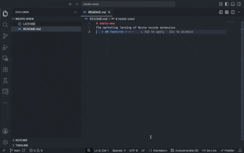

# Noote — Markdown Slash Commands

[](https://noote.iamsajaad.com)
[](https://noote.iamsajaad.com/buy-me-a-coffee)

Noote brings Notion-style slash commands, snippets, and smart list continuation to the VS Code Markdown editor. Type `/` in any Markdown file to open a filterable menu of block commands, inserted as snippets with tab stops — while everything stays a plain `.md` file under git.

**Website: <https://noote.iamsajaad.com>** · If Noote makes your notes flow, you can [buy me a coffee](https://noote.iamsajaad.com/buy-me-a-coffee). ☕

**VSCodium / Open VSX:** Noote is not listed on Open VSX yet — install the `.vsix` from [GitHub Releases](https://github.com/bysajaad/noote/releases).



## Usage

Start typing `/` on an empty line (or right after whitespace) in a markdown file. Keep typing to filter by a command's label or alias — e.g. `/tab` or `/table` both match **Table**. Accepting a suggestion replaces the `/` with the inserted snippet and places your cursor at its first tab stop.

The menu does **not** open inside fenced code blocks, inline code spans, or after a non-whitespace character (so it won't fire inside a URL like `https://`).

### List continuation

Pressing Enter inside a **Todo**, **Bulleted list**, or **Numbered list** item continues the list on the next line (numbered lists auto-increment; todos always start unchecked), matching WYSIWYG editor behavior. Pressing Enter on an *empty* list item exits the list instead — the marker is cleared and you're left on a plain paragraph line, i.e. "double Enter" ends the list.

## Right-to-left (RTL) text in VS Code's Markdown editors

VS Code ships more than one Markdown editing surface, and RTL support differs between them:

| Surface | RTL behavior |
|---|---|
| Text editor (default) | Renders RTL runs in the correct reading order on each line. |
| Markdown preview | Renders correct bidi order, but paragraphs stay left-aligned. |
| Markdown Editor (WYSIWYG, via *Reopen Editor With… → Markdown Editor*) | **No RTL support** — content is laid out with a left-to-right base direction, so RTL paragraphs align left, the caret starts on the wrong side, and punctuation at line edges is ordered incorrectly. |

Noote does not add RTL support, and it cannot patch the WYSIWYG editor: that surface is a sealed webview with a locked-down CSP and no extension contribution point for styles or scripts. The gap is tracked in [bysajaad/noote#1](https://github.com/bysajaad/noote/issues/1), with the upstream report at [microsoft/vscode#337009](https://github.com/microsoft/vscode/issues/337009).

### Workarounds

- **Edit RTL-heavy files in the text editor.** Right-click the editor tab and choose **Reopen Editor With… → Text Editor**, or pin it with `"workbench.editorAssociations": { "*.md": "default" }` in your settings.
- **Read and share via the Markdown preview** (**Markdown: Open Preview**), which renders RTL text in correct bidi order.
- **Force right-aligned rendering** in the preview and on GitHub by wrapping RTL sections in `<div dir="rtl">…</div>`. Markdown inside the `div` needs a blank line before and after it to render, and Noote's `/` menu also fires inside such HTML blocks (inserted markdown follows the same blank-line rule).
- **Customize the preview** further with the `markdown.styles` setting.

Noote's slash commands and list continuation work identically regardless of text direction. For why Noote does not ship its own editor, see [Non-goals](#non-goals).

## Commands

| Command | Aliases | Inserts |
|---|---|---|
| Title | `title` | `# ` |
| Heading 1 | `h1` | `# ` |
| Heading 2 | `h2` | `## ` |
| Heading 3 | `h3` | `### ` |
| Heading 4 | `h4` | `#### ` |
| Todo | `todo`, `task`, `checkbox` | `- [ ] ` |
| Bulleted list | `bullet`, `ul` | `- ` |
| Numbered list | `number`, `ol` | `1. ` |
| Strikethrough | `strikethrough`, `strike` | `~~text~~` |
| Underline | `underline` | `<u>text</u>` |
| Table | `table` | 3×2 GFM table skeleton |
| Quote | `quote`, `blockquote` | `> ` |
| Code block | `code`, `fence` | fenced code block with a tab stop on the language |
| Toggle block | `toggle`, `details`, `collapsible` | `<details><summary>...</summary>...</details>` |
| Divider | `divider`, `hr` | `---` |
| Page break | `pagebreak`, `break` | `<!-- pagebreak -->` |
| Link | `link` | `[text](url)` |
| Image | `image`, `img` | `` |
| Date | `date`, `today` | today's date as `YYYY-MM-DD` |
| Note | `note` | GFM `> [!NOTE]` alert |
| Tip | `tip` | GFM `> [!TIP]` alert |
| Warning | `warning` | GFM `> [!WARNING]` alert |
| Important | `important` | GFM `> [!IMPORTANT]` alert |
| Caution | `caution` | GFM `> [!CAUTION]` alert |

## Configuration

| Setting | Type | Default | Description |
|---|---|---|---|
| `mdSlash.enabled` | `boolean` | `true` | Enable the `/` slash command menu in markdown files. |
| `mdSlash.disabledCommands` | `string[]` | `[]` | Command labels to hide from the menu (e.g. `["Underline"]`). |
| `mdSlash.customSnippets` | `{ label, aliases?, snippet }[]` | `[]` | User-defined commands merged into the menu. `snippet` uses [VS Code snippet syntax](https://code.visualstudio.com/docs/editor/userdefinedsnippets#_snippet-syntax) (`$1`, `$0`, etc). |

Example:

```json
"mdSlash.disabledCommands": ["Underline", "Page break"],
"mdSlash.customSnippets": [
  { "label": "Meeting notes", "aliases": ["meeting"], "snippet": "## ${1:Meeting}\n\n- Attendees: $2\n- Notes: $0" }
]
```

## Development

```bash
npm install
npm run compile   # bundle src/extension.ts -> dist/extension.js
npm run watch      # same, in watch mode
```

Press `F5` in VS Code to launch an Extension Development Host with the extension loaded.

```bash
npm run typecheck
npm run lint
npm run test:unit         # plain mocha tests for pure logic (context.ts)
npm test                  # unit tests, then the @vscode/test-electron integration suite
```

## Non-goals

This extension is intentionally narrow: no webviews or custom editors, no WYSIWYG rendering, no git/GitHub sync, no note graph/wikilink features, and no telemetry. See [project-brief.md](https://github.com/bysajaad/noote/blob/main/project-brief.md) for the full rationale and the longer-term (out-of-scope) vision.

## License

MIT
